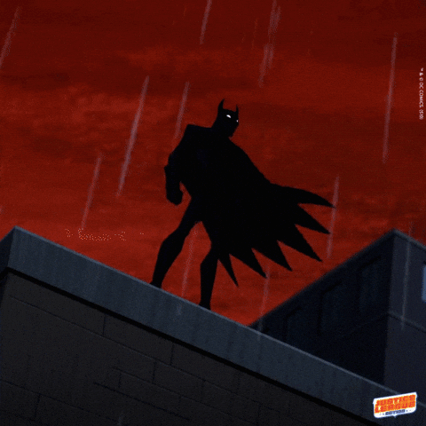

## Yo!!! Im danielmgallina! 👋

- 🧑‍💼 I’m currently working on Hotel Metropole Maringá
- 📚 I’m currently learning software engineering | Unicesumar
- ⚡ Fun fact: i like making cool design projects
## 

 

 

  
  
  
  
  
  

##

  
  
  
  
  

##

  

