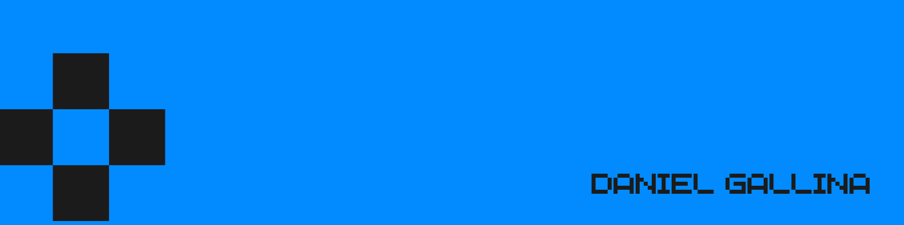

<!-- ==========================================================
                        DANIEL GALLINA
                     GITHUB PROFILE README
=========================================================== -->

 

<h3>SOFTWARE DEVELOPMENT • INFRASTRUCTURE • TECHNOLOGY</h3>

<code>Building systems. Solving problems. Learning continuously.</code>

  

<!-- ==========================================================
                         ABOUT ME
=========================================================== -->

<h2>👨‍💻 About Me</h2>

<table>
<tr>

<td width="60%" valign="middle">

<h3>Hi, I'm Daniel Gallina.</h3>

I'm passionate about <b>software development, infrastructure
and technology</b>.

I enjoy transforming real-world problems into functional
solutions through software, automation and infrastructure.

My interests include backend development, databases,
Linux environments, containers, networking and systems
integration.

 

<code>daniel@gallina:~$ whoami</code>

  

<b>Focus:</b> Software Development & Infrastructure

 

<b>Location:</b> Brazil

 

<b>Status:</b> Building_

  

<code>THINK → BUILD → TEST → IMPROVE → REPEAT</code>

</td>

<td width="40%" align="center" valign="middle">

</td>

</tr>
</table>

  

<!-- ==========================================================
                         TECH STACK
=========================================================== -->

<h2>⚡ Tech Stack</h2>

Technologies and tools I use to build, deploy and manage systems.

 

<h4>DEVELOPMENT</h4>

  

<h4>DATABASES • INFRASTRUCTURE • TOOLS</h4>

  

<code>C</code>
&nbsp;
<code>JAVASCRIPT</code>
&nbsp;
<code>TYPESCRIPT</code>
&nbsp;
<code>REACT</code>
&nbsp;
<code>NODE.JS</code>
&nbsp;
<code>POSTGRESQL</code>
&nbsp;
<code>DOCKER</code>
&nbsp;
<code>LINUX</code>

  

<!-- ==========================================================
                       GITHUB ANALYTICS
=========================================================== -->

<h2>📊 GitHub Analytics</h2>

Development activity and contribution history.

 

   

<!-- ==========================================================
                       FEATURED PROJECTS
=========================================================== -->

<h2>🚀 Featured Projects</h2>

Some of the projects and technologies I'm currently working with.

 

<table width="100%">
<tr>

<td width="50%" valign="top">

<h3>📅 EventsCalendar</h3>

Web platform for centralized event management,
scheduling and operational workflows.

 

<b>STACK</b>

  

<code>React</code>
<code>Node.js</code>
<code>PostgreSQL</code>
<code>Docker</code>

  

<b>● ACTIVE</b>

</td>

<td width="50%" valign="top">

<h3>⚙️ Automation & APIs</h3>

APIs and automation solutions focused on
system integration and process optimization.

 

<b>STACK</b>

  

<code>JavaScript</code>
<code>Node.js</code>
<code>REST API</code>
<code>SQL</code>

  

<b>● BUILDING</b>

</td>

</tr>
</table>

<table width="100%">
<tr>

<td width="50%" valign="top">

<h3>🖥️ Infrastructure Lab</h3>

Infrastructure projects involving servers,
monitoring, networking and virtualization.

 

<b>TECHNOLOGIES</b>

  

<code>Linux</code>
<code>Docker</code>
<code>Windows</code>
<code>Networking</code>

  

<b>● ACTIVE</b>

</td>

<td width="50%" valign="top">

<h3>💻 Software Development</h3>

Programming projects focused on algorithms,
software engineering and continuous learning.

 

<b>TECHNOLOGIES</b>

  

<code>C</code>
<code>JavaScript</code>
<code>Git</code>
<code>GitHub</code>

  

<b>● LEARNING</b>

</td>

</tr>
</table>

  

<!-- ==========================================================
                          FOCUS
=========================================================== -->

<h2>🎯 What I'm Working On</h2>

 

&nbsp;

  

&nbsp;

   

<!-- ==========================================================
                          CONNECT
=========================================================== -->

<h2>🌐 Connect With Me</h2>

Let's connect and build something.

 

&nbsp;

&nbsp;

    

<!-- ==========================================================
                           FOOTER
=========================================================== -->

  

<code>&lt; CODE • BUILD • LEARN • REPEAT /&gt;</code>

  

<b>● SYSTEM ONLINE</b>

 

Daniel Gallina • Software Development • Infrastructure • Technology

  

